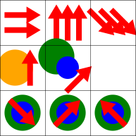

# Grid Generator

Python tool to generate images with shapes in a grid from a simple text representative file.

**The software is functional but still a bit rough around the edges.**

This tool is grid based and is not supposed to have floating items, all shapes will be linked to a cell and possibly displayed in it.
Each line of the input file is a table row and each column is delimited by `|` characters. At least one line should have all desired columns, otherwise trailing empty columns can be left empty.

Text file example (full):
```
{line[top,bottom]}2Arrow{right}|{line}3Arrow{top}|{bottom_right;line}3Arrow
{line}Circle{orange};Arrow|{top_right;line[top_left,bottom_right]}Circle{green}Circle{blue;50%}Arrow
{bottom_right}Circle{green}Circle{blue;50%}Arrow|{top_right}Circle{green}Circle{blue;50%}Arrow|{top_left}Circle{green}Circle{blue;50%}Arrow
```

Text file example (shortcuts):
```
{line[T,B]}2A{R}|{line}3A{T}|{C;line}3A
{line}C{orange};A|{E;line[Q,C]}C{green}C{blue;50%}A
{Z}C{green}C{blue;50%}A|{E}C{green}C{blue;50%}A|{Q}C{green}C{blue;50%}A
```

Result (as svg):




## Dependencies

This software uses Python 3.13+.

The rest of the dependencies can be seen in the [requirements.txt file](requirements.txt).

## Installation

In the root directory of this repo:

1. Setup a virtual environment `python -m venv .venv`.
1. Activate the virtual environment `source .venv/bin/activate` (linux) or `source .venv/Scripts/activate` (windows).
1. Install the requirements `pip install -r requirements.txt`.

## Usage

From outside this repo, with the virtual environment activated:

```bash
python -m grid-generator [options] <input_files..>
```

SVG files will be created in the directory of the input files or in the directory specified by `--dist`/`-d`.

*Warning:* the dist directory as to be created before-hand.

You can also run `python -m grid-generator --help` for help.

**Using test data as inputs:**

From outside this repo, inside the virtual environment:

```bash
python -m grid-generator -d grid-generator/dist grid-generator/test/data/samples/*.txt
```

## Input files

Grammar of the input file is described in its own [documentation file](doc/input_file_definition.md).

## Development

Unit tests can be run with `pytest grid-generator` from outside the root of this repository.

Coverage results can be obtained with `coverage run -m pytest grid-generator` then `coverage report -m`

## Author / Contributing

* Sylvain Domenjoud aka "[Sylordis](https://github.com/Sylordis)" (creator and maintainer)

## License

This project is licensed under the GPL-3.0 license - see the [LICENSE](LICENSE) file for details

## Links

Project website: <https://github.com/Sylordis/grid-generator/>

## Issues

Issues are reported here: <https://github.com/Sylordis/grid-generator/issues>
